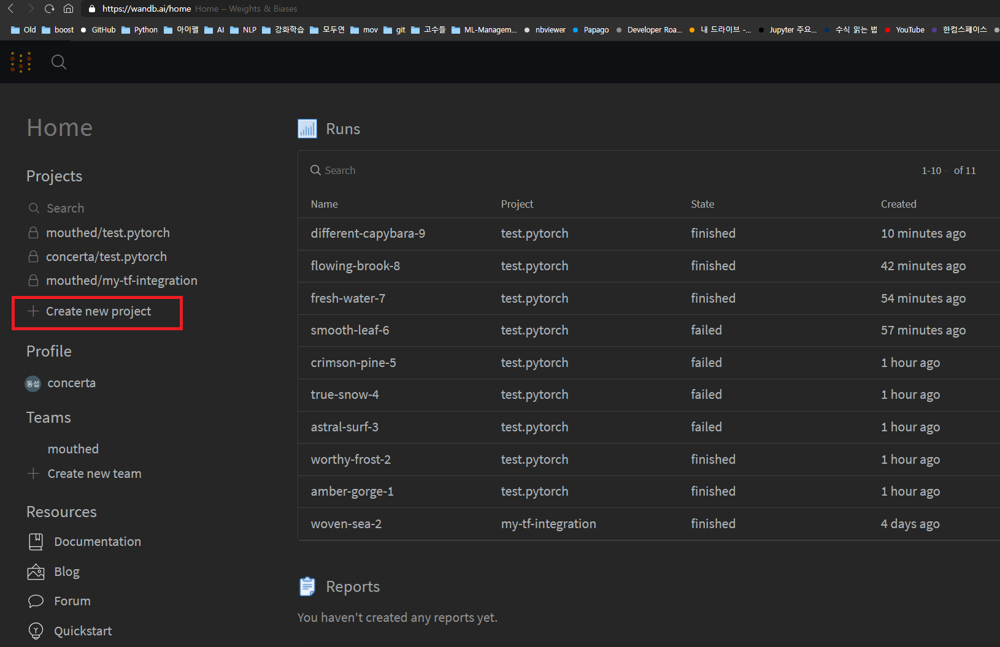

# wandb_test_.py

## torch

### 1. 퀵스타트 코드를 로컬 환경으로 카피
>https://github.com/pytorch/tutorials/blob/master/beginner_source/basics/quickstart_tutorial.py
> - 파이참/VS코드 등을 이용해 프로젝트 폴더를 생성

### 2. 코드 실행 준비
1. pip 업데이트 등
2. pip install
  - torch
  - torchvision
  - wandb    
3. wandb 가입 및 새 프로젝트 생성
> 
> 새 프로젝트 생성 위치

> 
> 프로젝트 기본 요구사항 입력 및 생성

> 
> 생성이 완료되면 프로젝트의 기본 타입별 튜토리얼을 확인할 수 있음

4. 터미널에서 wandb 로그인
  - $ wandb login
  - 토큰 입력
    > 

### 3. wandb로 트래킹하기
1. 코드(quickstart_tutorial.py) 수정
  - 위의 파이토치 퀵스타트 코드와 비교 확인
  - ctrl+f 로 wandb가 들어간 부분만 확인하면 됨
  - 위 wandb 공식제공 프리셋과 다른 점
    - config를 wandb.init의 파라미터로 넣은 부분 - 그냥 이렇게도 쓸 수 있다고 보면 됨.
```
import torch
from torch import nn
from torch.utils.data import DataLoader
from torchvision import datasets
from torchvision.transforms import ToTensor
import wandb

wandb.init(project="test.pytorch", entity="mouthed",
           config={
               "learning_rate": 0.001,
               "epochs": 10,
               "batch_size": 128}
           )
config = wandb.config
```
중략
```
def train(dataloader, model, loss_fn, optimizer):
    size = len(dataloader.dataset)
    model.train()
    for batch, (X, y) in enumerate(dataloader):
        X, y = X.to(device), y.to(device)

        # Compute prediction error
        pred = model(X)
        loss = loss_fn(pred, y)

        # Backpropagation
        optimizer.zero_grad()
        loss.backward()
        optimizer.step()

        if batch % 100 == 0:
            loss, current = loss.item(), batch * len(X)
            print(f"loss: {loss:>7f}  [{current:>5d}/{size:>5d}]")
            wandb.log({"loss":loss_fn})
```

```
def test(dataloader, model, loss_fn):
    size = len(dataloader.dataset)
    num_batches = len(dataloader)
    model.eval()
    test_loss, correct = 0, 0
    with torch.no_grad():
        for X, y in dataloader:
            X, y = X.to(device), y.to(device)
            pred = model(X)
            test_loss += loss_fn(pred, y).item()
            correct += (pred.argmax(1) == y).type(torch.float).sum().item()
    test_loss /= num_batches
    correct /= size
    print(f"Test Error: \n Accuracy: {(100*correct):>0.1f}%, Avg loss: {test_loss:>8f} \n")
    wandb.log({"acc_score":correct ,"test_loss":test_loss})
 ```

2. 코드 실행
  - 코드가 실행되면 데이터로더 구성 / f-mninst 데이터셋 다운 / 모델 생성 등이 자동으로 진행되고 학습함
3. 확인
  - wandb에서 확인
    >

